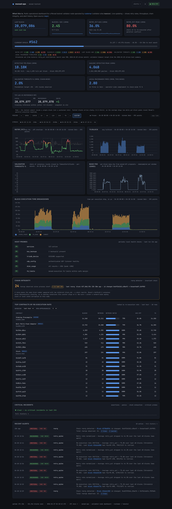

# monad-ops

A small dashboard + alerting tool that runs next to your
[Monad](https://monad.xyz) validator or full node. It reads the node's
own journals, keeps track of block-level execution metrics, catches
reorgs and hardware issues, and pings you on Telegram before things go
sideways.



I wrote it because I wanted answers to "why is *my* box acting up"
rather than "is it behind the network". Everything it shows is local:
derived from `monad-execution` / `monad-bft` journals and a handful of
probes on the same machine. No network-wide data, no external RPC
dependency for the core view.

## What you get

- **Live dashboard** at `/` — recent blocks, retry rate, TPS, gas,
  epoch progress, top retried contracts.
- **Alerts** for block stalls, retry-rate spikes, chain reorgs,
  reference-RPC lag, and assertion-like log patterns
  (`CXX_ASSERT`, `RUST_PANIC`, `QC_OVERSHOOT`, `CHUNK_EXHAUSTION`).
  Telegram by default, dedup + hysteresis so you don't get flapping.
- **Host probes** — systemd state of monad services, key-backup age,
  TrieDB disk health, UDP config, filesystem usage, `fd_limits`.
- **Alerts history** at `/alerts` — persisted across restarts,
  filterable by window / severity.
- **JSON API** for everything, plus a single-call
  `/api/window_summary` that gives an aggregate + top contracts for
  any window up to 30 days.
- **Independent watchdog** — a tiny bash script on a 5-second systemd
  timer that pokes the dashboard and pages Telegram if monad-ops
  itself dies. Because the whole point is to alert *when the thing
  that normally alerts you is what died*.


## How it works (short version)

A single process tails `journalctl -u monad-execution`, parses each
`__exec_block` record into a typed struct, feeds it through a handful
of rules, persists the result in SQLite, and serves a FastAPI
dashboard. A second worker fetches block receipts to attribute retry
activity to the contracts driving it. All SQLite writes happen off the
event loop so a slow aggregate query can't stall live ingestion. The
public `/alerts` page and JSON API are read-only — the dashboard
cannot write back to the node.

## Requirements

- Python 3.12+
- A Monad validator or full node on the same host (monad-ops tails
  `journalctl -u monad-execution`; the user running monad-ops must be
  in the `systemd-journal` group)
- SQLite ≥ 3.35
- A Telegram bot for alerts (optional but recommended)
- nginx (optional, for TLS + public virtual host)

## Install

```bash
git clone https://github.com/rustemar/monad-ops.git
cd monad-ops
python3 -m venv .venv
.venv/bin/pip install -e .
```

### Configure

```bash
cp config.example.toml config.toml
# fill in the Telegram bot token, chat ID, RPC URL, service names
```

Key sections of `config.toml`:

- `[node]` — display name, RPC URL, list of systemd services to probe.
- `[alerts.telegram]` — bot token (from `@BotFather`) and chat ID.
  Leave this section out to route alerts to stdout only (useful for
  dry-runs).
- `[storage]` — SQLite database path. Default is `data/state.db`.
- `[enrichment]` — receipts-enrichment worker settings.

### Run (manual)

```bash
.venv/bin/python -m monad_ops.cli run
# dashboard: http://127.0.0.1:8873
```

### Run (systemd)

```bash
sudo cp systemd/monad-ops.service.example \
    /etc/systemd/system/monad-ops.service
# edit the file: set User=, Group=, WorkingDirectory=, ExecStart=
sudo systemctl daemon-reload
sudo systemctl enable --now monad-ops.service
```

### Watchdog (optional, recommended)

```bash
cp scripts/watchdog.env.example scripts/watchdog.env
chmod 600 scripts/watchdog.env
# fill in TG_BOT_TOKEN, TG_CHAT_ID, TG_TOPIC_ID
sudo cp systemd/monad-ops-watchdog.service.example \
    /etc/systemd/system/monad-ops-watchdog.service
sudo cp systemd/monad-ops-watchdog.timer \
    /etc/systemd/system/monad-ops-watchdog.timer
# edit the .service file: paths + User=
sudo systemctl daemon-reload
sudo systemctl enable --now monad-ops-watchdog.timer
```

### Public dashboard (optional)

A ready nginx template lives in
`systemd/nginx-ops-dashboard.conf.example`. It expects a TLS cert, a
`<dashboard-domain>` substitution, and an upstream on `127.0.0.1:8873`.
It blocks `/api/probes` at the nginx layer (that endpoint carries
host-sensitive paths) and sets CSP / HSTS / X-Frame-Options /
Permissions-Policy on every response.

## API

The full reference with curl examples lives at `/api` on any running
instance. In brief:

- `GET /api/state` — live snapshot (blocks, rolling metrics, epoch,
  reorg counter, reference-RPC lag).
- `GET /api/blocks/sampled?from_ts_ms=&to_ts_ms=&points=300` —
  server-aggregated time-series for charts.
- `GET /api/alerts/history?window=&severity=&limit=` — persisted
  alerts.
- `GET /api/reorgs` — all observed reorgs, newest-first.
- `GET /api/reorgs/{block_number}?window=N` — per-event forensic
  trace (reorged block + ±N neighbors).
- `GET /api/contracts/top_retried?since_ts_ms=&…` — contracts ranked
  by re-execution.
- `GET /api/window_summary?from_ts_ms=&to_ts_ms=&include_blocks=`
  — single-call post-event report.
- `GET /api/probes/public` — sanitized host-probe status.

All JSON routes ship `Access-Control-Allow-Origin: *` so external
dashboards can pull from the browser. The HTML dashboard itself stays
on a strict CSP.

## Development

```bash
.venv/bin/pip install -e '.[dev]'
.venv/bin/python -m pytest -q
.venv/bin/ruff check .
```

Layout:

```
monad_ops/
├── cli.py              # entry point + async task wiring
├── api/                # FastAPI app, endpoints, cache layer
├── collector/          # journal tailer, probes, reference RPC, epoch
├── dashboard/          # Jinja templates, static JS/CSS/Chart.js
├── enricher/           # eth_getBlockReceipts worker
├── parser/             # __exec_block / assertion line parsers
├── rules/              # stall, retry_spike, reorg, reference_lag,
│                       # assertion — alert-emitting rules
├── alerts/             # sinks (Telegram, stdout, deduping)
├── state.py            # in-memory snapshot + EpochTracker
├── storage.py          # SQLite schema, migrations, aggregates
└── config.py           # Pydantic settings
```

Tests live in `tests/` (unit-level per module; no network in the
suite).

## License

Apache-2.0 — see [LICENSE](LICENSE).
