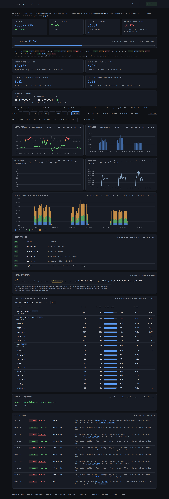

# monad-ops

A live dashboard + alerting daemon for [Monad](https://monad.xyz)
validators and full nodes. It reads the node's own journals, tracks
block-level execution metrics, catches reorgs / retry-spikes /
hardware issues in real time, and pings you on Telegram before things
go sideways.



I wrote it because I wanted answers to "why is *my* box acting up"
rather than "is it behind the network". Everything it shows is local:
derived from `monad-execution` / `monad-bft` journals and a handful of
probes on the same machine. No network-wide data, no external RPC
dependency for the core view.

## What you get

- **Live dashboard** at `/` — recent blocks, retry rate, TPS, gas,
  epoch progress, top retried contracts.
- **Alerts** — ten rules covering block stalls, retry-rate spikes,
  execution-layer divergence, reference-RPC lag, assertion/panic log
  patterns, per-block processing slowdown, monad-bft network-layer
  errors, service restarts, the v0.14.5 waltrace flood, and new package
  releases. Telegram by default, dedup + hysteresis so you don't get
  flapping. Full reference in [docs/rules.md](docs/rules.md).
- **Host probes** — systemd state of monad services, key-backup age,
  TrieDB disk health, UDP config, filesystem usage, `fd_limits`.
- **Alerts history** at `/alerts` — persisted across restarts,
  filterable by window / severity.
- **JSON API** for everything, plus a single-call
  `/api/window_summary` that gives an aggregate + top contracts for
  any window up to 30 days.
- **Independent watchdog** — a tiny bash script on a 5-second systemd
  timer that pokes the dashboard and pages Telegram if monad-ops
  itself dies. Because the whole point is to alert *when the thing
  that normally alerts you is what died*.

## Observations

Field notes from running this against Monad testnet, with data and
explicit hypotheses — see [OBSERVATIONS.md](OBSERVATIONS.md). First
entry is the 23-reorg window observed 2026-04-19 / 2026-04-20.

## How it works (short version)

A single process tails `journalctl -u monad-execution`, parses each
`__exec_block` record into a typed struct, feeds it through a handful
of rules, persists the result in SQLite, and serves a FastAPI
dashboard. A second worker fetches block receipts to attribute retry
activity to the contracts driving it. All SQLite writes happen off the
event loop so a slow aggregate query can't stall live ingestion. The
public `/alerts` page and JSON API are read-only — the dashboard
cannot write back to the node.

## Rules

| Rule | Fires on | Severities |
| --- | --- | --- |
| `stall` | no new block for N seconds | WARN, CRITICAL |
| `retry_spike` | sustained high `retry_pct` | WARN, CRITICAL |
| `reorg` | same height, different execution `block_id` | INFO, WARN |
| `reference_lag` | local tip behind a public reference RPC | WARN, CRITICAL |
| `assertion` | assertion / panic / FATAL log lines | WARN, CRITICAL |
| `block_processing_slowdown` | rolling median `total_us` in stress territory | WARN, CRITICAL |
| `network_layer_signal` | monad-bft network-layer error rate | WARN, CRITICAL |
| `process_restart` | a tracked systemd unit's `InvocationID` changed | WARN |
| `waltrace_flood` | `waltrace thread stopped` flood | WARN, CRITICAL |
| `version_watch` | a newer stable package appeared in the apt repo | INFO |

[docs/rules.md](docs/rules.md) documents each one: what it fires on, the
field evidence behind its defaults, and every config key. Worth reading
before you tune thresholds — most of them were moved in response to
specific alert-noise audits, and the reasoning is recorded there.

## Requirements

- A Monad validator or full node on the same host, running under
  systemd (monad-ops tails `journalctl -u monad-execution` and
  `journalctl -u monad-bft`, and probes service state via `systemctl`).
- Python 3.12+ with SQLite ≥ 3.35.
- A Telegram bot for alerts — optional. Leave the token blank and the
  dashboard runs alert-free; you can wire Telegram later.

monad-ops is intentionally a host process, not a container: every
interface point with the node (journals, `systemctl is-active`,
key-backup paths, host RPC) is shaped by host systemd. Wrapping it
in Docker means re-mounting all of those, and `systemctl is-active`
still won't see the host's units from inside the container.

## Install

```bash
git clone https://github.com/rustemar/monad-ops.git
cd monad-ops
python3 -m venv .venv
.venv/bin/pip install -e .
cp config.example.toml config.toml
# edit config.toml: [node].name, RPC URL, optional Telegram
```

Key sections of `config.toml`:

- `[node]` — display name, RPC URL, list of systemd services to probe,
  and the public reference RPC used for the lag comparison.
- `[alerts.telegram]` — bot token (from `@BotFather`) and chat ID.
  Blank `bot_token` (or omitting the section) routes alerts to stdout.
- `[rules.*]` — one section per rule; see [docs/rules.md](docs/rules.md).
- `[persistence]` — SQLite database path. Default is `data/state.db`.
- `[enrichment]` — receipts-enrichment worker settings.
- `[retention]` — background pruning. Off by default, so the database
  accrues forever until you turn it on.

Every section has working defaults except `[node].name`. `config.example.toml`
carries the full set with the defaults spelled out.

The user running monad-ops must be in the `systemd-journal` group.
Add it once and re-login:

```bash
sudo usermod -aG systemd-journal "$(id -un)"
```

Or, if you don't want a global group change, uncomment the
`SupplementaryGroups=systemd-journal` line in
`systemd/monad-ops.service.example` so the unit grants journal access
only to the service.

### Run (manual)

```bash
.venv/bin/python -m monad_ops.cli run
# dashboard: http://127.0.0.1:8873
```

### Run (systemd, recommended)

```bash
sudo cp systemd/monad-ops.service.example \
    /etc/systemd/system/monad-ops.service
# edit the file: set User=, Group=, WorkingDirectory=, ExecStart=
sudo systemctl daemon-reload
sudo systemctl enable --now monad-ops.service
```

### Watchdog (optional, recommended)

```bash
cp scripts/watchdog.env.example scripts/watchdog.env
chmod 600 scripts/watchdog.env
# fill in TG_BOT_TOKEN, TG_CHAT_ID, TG_TOPIC_ID
sudo cp systemd/monad-ops-watchdog.service.example \
    /etc/systemd/system/monad-ops-watchdog.service
sudo cp systemd/monad-ops-watchdog.timer \
    /etc/systemd/system/monad-ops-watchdog.timer
# edit the .service file: paths + User=
sudo systemctl daemon-reload
sudo systemctl enable --now monad-ops-watchdog.timer
```

### Update

`monad-ops` is editable-installed (`pip install -e .`), so a code
upgrade is just a fast-forward pull plus a service restart:

```bash
cd /opt/monad-ops          # or wherever you cloned it
git pull --ff-only origin main
sudo systemctl restart monad-ops.service
```

Schema migrations are applied automatically on service start —
idempotent `ALTER TABLE … ADD COLUMN` is run for any new columns
introduced upstream. No manual SQL is required, and the migration is a
no-op once the column exists.

Two cases that need an extra step (rare):

- `pyproject.toml` dependencies changed — also run
  `.venv/bin/pip install -e .` after the pull. Release notes will call
  this out when needed.
- `config.toml` schema changed (a new required field, a renamed key) —
  diff your `config.toml` against `config.example.toml` and copy the
  delta over. Optional fields keep working as-is.

To see what changed before pulling: `git fetch origin main && git log
--oneline HEAD..origin/main`.

### Public dashboard (optional)

A ready nginx template lives in
`systemd/nginx-ops-dashboard.conf.example`. It expects a TLS cert, a
`<dashboard-domain>` substitution, and an upstream on `127.0.0.1:8873`.
It sets CSP / HSTS / X-Frame-Options / Permissions-Policy on every
response.

## API

The full reference with curl examples lives at `/api` on any running
instance. In brief:

- `GET /api/state` — live snapshot (blocks, rolling metrics, epoch,
  reorg counter, reference-RPC lag).
- `GET /api/blocks/sampled?from_ts_ms=&to_ts_ms=&points=300` —
  server-aggregated time-series for charts.
- `GET /api/alerts/history?window=&severity=&limit=` — persisted
  alerts.
- `GET /api/reorgs` — all observed reorgs, newest-first.
- `GET /api/reorgs/{block_number}?window=N` — per-event forensic
  trace (reorged block + ±N neighbors).
- `GET /api/contracts/top_retried?since_ts_ms=&…` — contracts ranked
  by re-execution.
- `GET /api/window_summary?from_ts_ms=&to_ts_ms=&include_blocks=`
  — single-call post-event report.
- `GET /api/probes` — sanitized host-probe status.
- `GET /api/status/errors` — HTTP error counters plus `parse_drift`:
  log lines the parser recognised but could not extract, per kind.
  Non-zero means the node release moved the log schema.

All JSON routes ship `Access-Control-Allow-Origin: *` so external
dashboards can pull from the browser. The HTML dashboard itself stays
on a strict CSP.

## Development

```bash
.venv/bin/pip install -e '.[dev]'
.venv/bin/python -m pytest -q
.venv/bin/ruff check .
```

Layout:

```
monad_ops/
├── cli.py              # entry point + async task wiring
├── api/                # FastAPI app, endpoints, cache layer
├── collector/          # journal tailer, probes, reference RPC, epoch
├── dashboard/          # Jinja templates, static JS/CSS/Chart.js
├── enricher/           # eth_getBlockReceipts worker
├── parser/             # __exec_block / assertion line parsers
├── rules/              # the ten alert-emitting rules (docs/rules.md)
├── alerts/             # sinks (Telegram, stdout, deduping)
├── state.py            # in-memory snapshot + EpochTracker
├── storage.py          # SQLite schema, migrations, aggregates
└── config.py           # Pydantic settings
```

Tests live in `tests/` (unit-level per module; no network in the
suite).

## License

Apache-2.0 — see [LICENSE](LICENSE).
